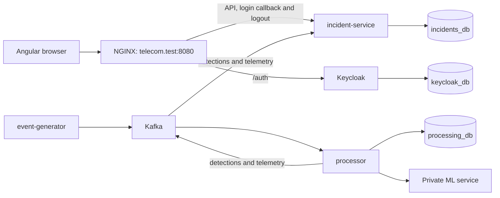
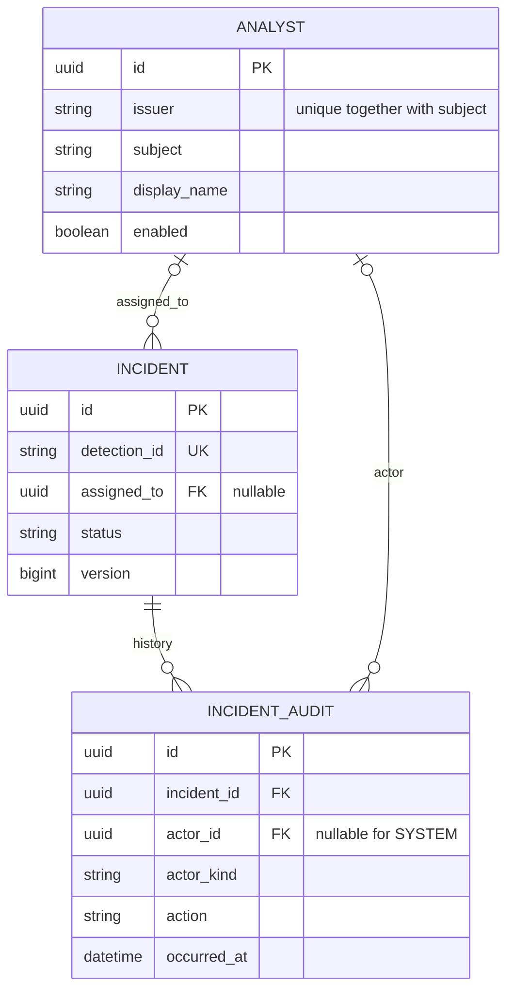

# ADR 002: Database ownership and browser identity

Date: 2026-09-11

Owner: Moroz Denis

Status: Proposed for review with Stanislav, David and Sergiu

## Context and scope

This records the Day 01 design from the team plans, Revision 2 (11 September
2026): backend plan pages 5 and 18-24; common guide pages 3-6, 10-20 and 22.
It replaces the earlier one-database/two-schema and custom JWT-cookie design.

The current infrastructure starter at `c0af59c` still provisions PostgreSQL and
Kafka with one `telecom` database. This decision does not deploy Keycloak, change
database volumes or implement Spring Boot. Application scaffolding and migrations
start on Day 02; the first authenticated integration gate is 15 September.

## Database ownership

Use three logical databases in one local PostgreSQL 16 server. They share resources
and a failure domain; this is access isolation, not high availability.

| Database | Only application writer | Runtime role | Migration/owner role | Data |
| --- | --- | --- | --- | --- |
| `incidents_db` | incident-service | `incidents_app` | `incidents_migrator` | Analysts, incidents, evidence, audit, traffic summaries |
| `processing_db` | processor | `processing_app` | `processing_migrator` | Receipts, windows and delivery outboxes |
| `keycloak_db` | Keycloak | `keycloak_app` | Keycloak manages its own schema | Credentials and identity-provider state |

Both application databases use an `app` schema. Runtime roles can read/write their
own application data but cannot create database objects or connect to the other
two databases. Migrators own their application schema and run Flyway. Revoke
PUBLIC CONNECT on all three databases and runtime CREATE privileges. Keep
administrator and migration credentials separate from normal application access.
An isolated migration job is the delivery target; local separate Flyway credentials
still exist in the application process and do not provide that process isolation.

There are no cross-database queries or foreign keys. The generator and ML service
do not need their own databases for this MVP. NGINX serves/routes the app; no
dedicated API gateway is introduced. Internal application access uses the private
single-host Docker network.

## Analyst identity and incident relationships

Each local analyst has `id` (UUID), `issuer`, `subject`, `displayName` and `enabled`.
Enforce `UNIQUE(issuer, subject)` in PostgreSQL. OIDC `subject` is an opaque string;
do not assume it is a UUID. Email and display name are not identity keys.

Incident and audit IDs are UUIDs. `assigneeId` in the API maps to the local analyst
UUID in `assigned_to`. SYSTEM actions have no analyst actor. Do not query
`keycloak_db` to look up a user. Controlled provisioning supplies matching
issuer/subject values; fixture subjects are synthetic and are not provisioned users.
Profile synchronization must never automatically re-enable a disabled local analyst.

The trusted record format is [analyst-directory.schema.json](../../contracts/identity/analyst-directory.schema.json).
The public directory returns only `id`, `displayName` and `enabled`.

## Login, session and CSRF contract

Keycloak performs login using OpenID Connect authorization code with PKCE S256.
The confidential client is `telecom-web`. The backend exchanges the code, validates
the OIDC identity and creates a server-side session. Tokens and the client secret
remain on the backend; no local password, token-issuing or refresh-token endpoint
is part of the incident API.

| Setting | Local development value |
| --- | --- |
| Browser origin | `http://telecom.test:8080` |
| Issuer | `http://telecom.test:8080/auth/realms/telecom` |
| Login start | `GET /oauth2/authorization/keycloak` |
| Exact callback | `http://telecom.test:8080/login/oauth2/code/keycloak` |
| Success destination | `/dashboard` |
| Post-logout destination | `http://telecom.test:8080/signed-out` |
| Session discovery | `GET /api/auth/me` |
| CSRF discovery | `GET /api/auth/csrf` (public) |
| Logout | `POST /logout` as a browser form with `_csrf` |

Use the opaque `JSESSIONID` cookie, HttpOnly, SameSite=Lax, Path=/; Secure is false
only for the loopback-bound local HTTP profile and true with HTTPS. This cookie is
not a JWT. One backend instance stores sessions in memory for the MVP. Backend
restart requires login again but preserves database records.

Sessions expire after 15 idle minutes or 30 absolute minutes from successful login,
whichever comes first. API polling and SSE must not extend the absolute deadline.
`/api/auth/me` returns `analystId`, `displayName`, `roles` and `expiresAt`.

Keep Spring CSRF validation on mutations. CSRF discovery returns `token`,
`headerName` and `parameterName`; this draft uses `X-CSRF-TOKEN` and `_csrf`.
Angular sends the returned token under the returned name and refreshes it after
login/logout. Logout invalidates the local session, closes associated SSE streams
and attempts Keycloak RP-initiated logout through browser navigation. A valid local
session may continue during a Keycloak outage until expiry; new login cannot.

Provision a multi-valued `app_roles` claim in the ID token. Map only ANALYST,
SUPERVISOR and ADMIN to application authorities. Never trust actor IDs or roles
from request JSON. Existing sessions do not immediately reflect Keycloak role or
account changes; re-login or explicit session invalidation is needed.

| Action | ANALYST | SUPERVISOR / ADMIN |
| --- | --- | --- |
| Read incidents, directory and summaries | Yes | Yes |
| Claim an unassigned incident for self | Yes | Yes |
| Reassign to an enabled analyst | No | Yes |
| Change status or comment | Assigned analyst only | Any incident |
| Start/stop simulator scenarios | No | Yes |

Mutations require an enabled local analyst record. Application ADMIN is not a
Keycloak realm administrator. Anonymous/expired API calls return JSON 401;
permission/CSRF failures return JSON 403, not a login page.

## Canonical API and fixture decisions

The only API definition is [incident-api.yaml](../../contracts/openapi/incident-api.yaml).
The earlier `contracts/openapi.yaml` is migrated to this location. Fixtures remain
under `contracts/fixtures/`; they are not API definitions.

- Revised routes are `/api/incidents/{id}/assignment`, `/api/analysts` and
  `/api/incidents/stream`. The list envelope is `items,total,page,size`, ordered
  by `detectedAt DESC,id DESC` with default page 0/size 20 and maximum size 100.
- OPEN -> INVESTIGATING requires assignment. INVESTIGATING -> RESOLVED requires
  a nonblank note and retains assignment. No direct resolution or reopening.
- Status, assignment and comments use a nonnegative version. Enforce permissions
  and optimistic locking in the service; write the change and audit together.
- Detection results are immutable and deduplicated by detectionId. Do not
  recalculate scores, overwrite explanations or reopen incidents on replay.
- Risk 40-69 is MEDIUM, 70-89 HIGH, 90-100 CRITICAL; values below 40 do not create
  an MVP incident. Retain uncappedScore alongside the capped score.
- Revision 2 names are `anomalyRank`, `evidenceCount`, `evidenceSamples` and
  `ML_ANOMALY`. mlStatus is OK, TIMEOUT, UNAVAILABLE or NOT_APPLICABLE.
- The updated open incident fixture uses 60 calls, 54 international (ratio 0.90),
  an unusual country and unavailable ML: 60 + 10 + 10 = 80, severity HIGH.
  Evidence is one representative sample of 60 calls, not a full event replay.
- Hash detection identity as SHA-256 of UTF-8
  `entityType|entityId|anomalyType|windowStart|rulesetVersion`, using canonical UTC
  instants and separator-free identifiers. Retries reuse the saved identity/data.

Day-one proposed details requiring review include the public assignee projection,
bounded audit projection, exact field-error structure and request length limits.
Typed reason codes/EventV1 payloads and all valid scenario values remain jointly
reviewed with their producer owners. A permissive evidence payload schema in this
API draft is not a substitute for EventV1 validation at ingestion.

## Implementation and handoff

Denis initializes `services/incident-service` on Day 02 using Java 21 and the
compatible Boot 3.5 / Security 6.5 family targeted by the PDF examples; select
tested patch versions together. Use controller -> service -> repository -> database.
Add JPA, Kafka, OAuth2 Client, Actuator and Flyway; configure `ddl-auto=validate`.

Stanislav owns the database/Keycloak/NGINX provisioning upgrade. Editing PostgreSQL
init scripts does not upgrade an existing volume. Back up first, preserve useful
data, retain PostgreSQL major 16 during this split, and follow the common guide's
explicit upgrade path. Do not delete volumes to implement this decision.

Review still required (not claimed complete):

- Stanislav + David: issuer, redirect URLs, cookie/CSRF names, app_roles mapping
  and session behavior. Browser and backend must resolve the same issuer.
- Stanislav + Denis: database grants and migration/runtime credentials.
- Sergiu + Denis: DetectionV1, hash vector, immutable scores and explanations.
- Ion + Denis: event/run UUIDs, EventV1 evidence and simulator controls.
- David + Denis: API/fixture shapes, assigned-analyst permissions and reconnect.

## Technical references

- [OpenAPI 3.0.3](https://spec.openapis.org/oas/v3.0.3.html)
- [Spring Security OAuth2 login](https://docs.spring.io/spring-security/reference/servlet/oauth2/login/core.html)
- [Spring Security CSRF](https://docs.spring.io/spring-security/reference/servlet/exploits/csrf.html)

These are reference links, not evidence of a running or integration-tested service.
